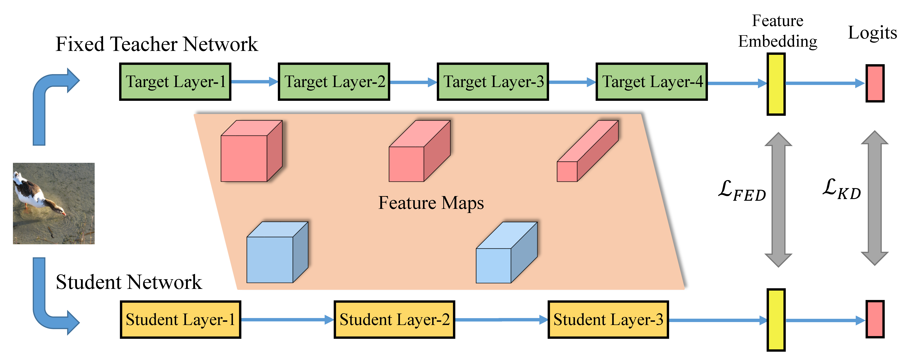
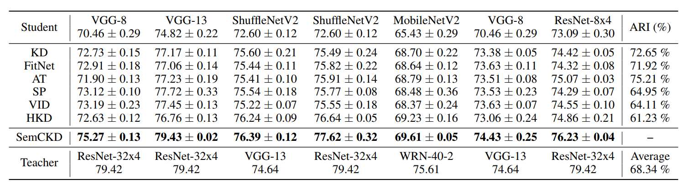

# SemCKD

Cross-Layer Distillation with Semantic Calibration (AAAI-2021) https://arxiv.org/abs/2012.03236

The existing *feature distillation* works can be separated into two categories according to the position where the knowledge distillation is performed. As shown in the figure below, one is *feature-map distillation* and another one is *feature-embedding distillation*.



SemCKD belongs to *feature-map distillation* and is compatible with SOTA *feature-embedding distillation* (e.g., CRD) to further boost the performance of Student Networks.

This repo contains the implementation of SemCKD together with the compared approaches, such as classic KD, *Feature-Map Distillation* variants like FitNet, AT, SP, VID, HKD and *feature-embedding distillation* variants like PKT, RKD, IRG, CC, CRD.

**CIFAR-100 Results**



where *ARI* means *Average Relative Improvement*. This evaluation metric reflects the extent to which SemCKD further improves on the basis of existing approaches compared to improvements made by these approaches upon the baseline student model. 

To get the pretrained teacher models for CIFAR-100:

```
sh scripts/fetch_pretrained_teachers.sh
```

For ImageNet, pretrained models from torchvision are used, e.g. [ResNet34](https://download.pytorch.org/models/resnet34-333f7ec4.pth). Save the model to ./save/models/$MODEL_vanilla/ and use scripts/model_transform.py to make it readable by our code.

Running SemCKD:

```bash
# CIFAR-100
python train_student.py --path-t ./save/models/resnet32x4_vanilla/ckpt_epoch_240.pth --distill semckd --model_s resnet8x4 -r 1 -a 1 -b 400 --trial 0
# ImageNet
python train_student.py --path-t ./save/models/ResNet34_vanilla/resnet34_transformed.pth \
--batch_size 256 --epochs 90 --dataset imagenet --gpu_id 0,1,2,3,4,5,6,7 --dist-url tcp://127.0.0.1:23333 \
--print-freq 100 --num_workers 32 --distill semckd --model_s ResNet18 -r 1 -a 1 -b 50 --trial 0 \
--multiprocessing-distributed --learning_rate 0.1 --lr_decay_epochs 30,60 --weight_decay 1e-4 --dali gpu
```

**Post Scripts:** 
- The implementation of compared methods are based on the author-provided code and a open-source benchmark https://github.com/HobbitLong/RepDistiller. The main difference is that we set both weights for classification loss and logit-level distillation loss as **1** throughout the experiments, which is a more common practice for knowledge distillation. (*-r 1 -a 1*) 
- Note that the wide ResNet model in the "RepDistiller/models/wrn.py" is almost the same as those in resnet.py. For example, wrn_40_2 in wrn.py almost equals to resnet38x2 in resnet.py. The only difference is that resnet38x2 has additional three BN layers, which will lead to 2*(16+32+64)*k parameters [k=2 in this comparison].
- Three FC layers of VGG-ImageNet are replaced with single one, thus the total layer number should be reduced by two on CIFAR-100. For example, the actual number of layers for VGG-8 is 6.
- Computing Infrastructure:
  - For CIFAR-100,  we run experiments on a single machine that contains one NVIDIA GeForce TITAN X-Pascal GPU with 12 GB of RAM at 11.4 Gbps memory speed, 32 Inter (R) Xeon (R) CPU E5-2620 v4 @ 2.10GHz. The CUDA version is 10.2. The PyTorch version is 1.0.
  - For ImageNet, we run experiments on a single machine that contains eight NVIDIA GeForce RTX 2080Ti GPUs with 11 GB of RAM at 14 Gbps memory speed, 64 Intel (R) Xeon (R) Silver 4216 CPU @ 2.10 GHz. The CUDA version is 10.2. The PyTorch version is 1.6.


- The codes in this repository was merged from different sources, and we have not tested them thoroughly. Hence, if you have any questions, please contact us without hesitation.

## Citation
If you find this repository useful, please consider citing the following paper:
```
@inproceedings{chen2021cross,
  author    = {Defang Chen and Jian{-}Ping Mei and Yuan Zhang and Can Wang and Zhe Wang and Yan Feng and Chun Chen},
  title     = {Cross-Layer Distillation with Semantic Calibration},
  booktitle = {Proceedings of the AAAI Conference on Artificial Intelligence},
  pages     = {7028--7036},
  year      = {2021},
}

```
